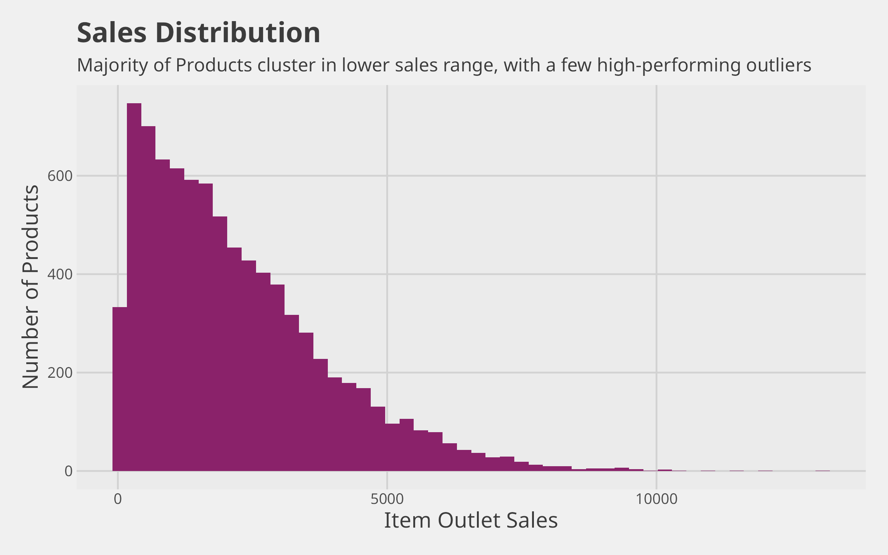
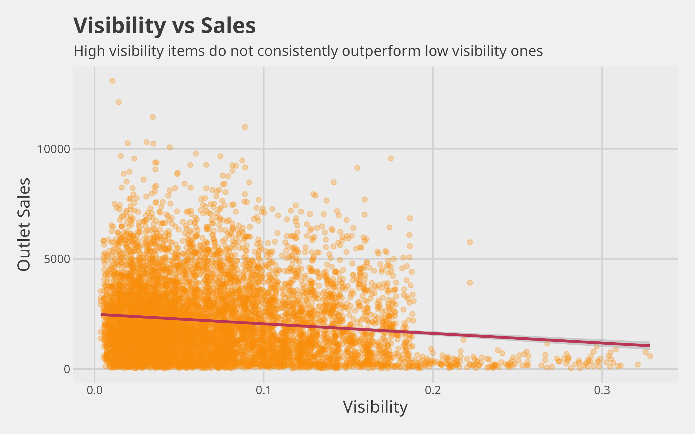
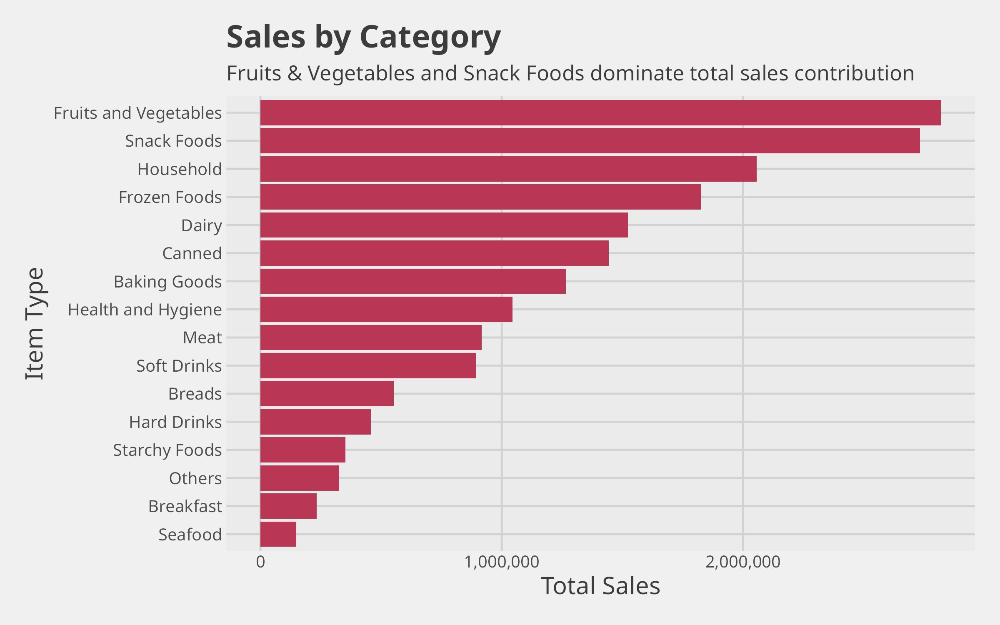

# 🛒 BigMart Sales Analysis: Revenue Optimization

## 📌 Overview

This project analyzes BigMart retail sales data to uncover key revenue drivers, product trends, and outlet performance insights. The goal is to translate raw data into actionable business recommendations.

---

## 🎯 Business Problem

How can BigMart optimize product strategy and outlet performance to increase overall revenue?

---

## 📊 Dataset

* **Records:** 8,523
* **Features:** 12
* **Source:** Kaggle [BigMart Sales Data](https://www.kaggle.com/datasets/brijbhushannanda1979/bigmart-sales-data/data?select=Train.csv)

---

## 🛠️ Tools & Technologies

* **R** (tidyverse, dplyr, ggplot2, and more)
* Data Cleaning & Transformation
* Exploratory Data Analysis (EDA)
* Data Visualization

---

## 🔍 Analysis Workflow

1. Data Loading & Inspection
2. Data Cleaning (missing values, inconsistencies)
3. Exploratory Data Analysis
4. Visualization of key patterns
5. Insight generation & business recommendations

---

## 📈 Key Insights

* Certain outlet types contribute disproportionately to total revenue.
* Product visibility does not always correlate strongly with sales.
* Tier 3 locations show competitive or higher performance in select categories.
* A small subset of products drives a large portion of revenue (skewed distribution).

---

## 💡 Recommendations

* Increase inventory and promotion of high-performing product categories.
* Re-evaluate underperforming outlet types and locations.
* Optimize product placement and visibility strategies.
* Focus on high-revenue outlets for targeted marketing campaigns.

---

## 📊 Sample Visualizations







---

## 📂 Project Structure

```
bigmart-sales-analysis/
│
├── data/
│   ├── raw/
│   │   └── Train.csv
│   │
│   ├── cleaned/
│   │   └── bigmart_cleaned.csv
│   │
│   └── processed/
│       ├── multi_analysis.csv
│       ├── sales_by_category.csv
│       ├── sales_by_fat.csv
│       ├── sales_by_location.csv
│       └── sales_by_outlet.csv
│
├── report/
│   ├── bigmart_analysis.Rmd
│   └── bigmart_analysis.html
│
├── scripts/
│   ├── 01_data_loading.R
│   ├── 02_data_cleaning.R
│   ├── 03_eda.R
│   └── 04_visualization.R
│
├── visualizations/
│   ├── 01_sales_distribution.png
│   ├── 02_sales_vs_mrp.png
│   ├── 03_visibility_vs_sales.png
│   ├── 04_outlet_age_vs_outlet_sales.png
│   ├── 05_sales_by_outlet_type.png
│   ├── 06_total_sales_by_location_tier.png
│   ├── 07_sales_by_category.png
│   └── 08_sales_by_fat_content.png
│
├── .gitattributes
├── LICENSE
├── README.md
└── bigmart-sales-analysis.Rproj
```

---

## 📄 Full Report

👉 [View Complete Analysis](https://htmlpreview.github.io/?https://github.com/ananyalytics/bigmart-sales-analysis/blob/main/report/bigmart_analysis.html)

---

## 🚀 Key Takeaways

This project demonstrates:

* Clean and structured real-world data
* Extraction of meaningful business insights
* Effective presentation of findings through visualizations and reports

---

## 📌 Future Improvements

* Add statistical analysis for deeper validation
* Build predictive models for sales forecasting
* Develop an interactive dashboard (Power BI / Tableau)

---

## 👤 Author

Ananya Jha

LinkedIn - [ananyalytics07](https://www.linkedin.com/in/ananyalytics07)

GitHub - [ananyalytics](https://github.com/ananyalytics)
